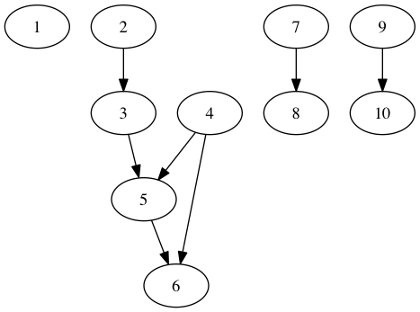

## Install

Requires Python3

Install [Postgres.app](http://postgresapp.com/)

```
$ brew install kafka graphviz
$ pip install -r requirements.txt

$ createdb schedule
$ psql -d schedule -f tables.sql
```

## Usage

Start Postgres.app

```
$ zkServer start
$ kafka-server-start server.properties

$ ipython -i js/main.py
```

Generate fake data

```python
# Generate new changes for the root datasets
root_datasets = db.load_root_datasets(cur)
changes = gen_changes(root_datasets)

# Push those changes into Kafka
stream.push_changes(producer, changes)
```

Run all jobs until a new steady state is reached

```python
# Pull changes from Kafka and store them in the DB
pull_new_changes(cur, consumer)

# Run new changes
process_pending_changes(cur)
```

## Example



Changes

```
[
  Change(id=None, ds_id=1, status='pending', start=datetime.datetime(2016, 1, 6, 0, 0), stop=datetime.datetime(2016, 1, 12, 0, 0), created_at=datetime.datetime(2016, 7, 10, 13, 56, 56)),
  Change(id=None, ds_id=6, status='pending', start=datetime.datetime(2016, 1, 6, 0, 0), stop=datetime.datetime(2016, 1, 12, 0, 0), created_at=datetime.datetime(2016, 7, 10, 13, 56, 56))
]
```

Execution Log

```
run		     change(1, 1, running, 2016-01-06 00:00:00 - 2016-01-12 00:00:00)
  run		 execution(1, 2, running, None)
    launch	 job(2, 2, jobs/ipdbcy.sh)
  success	 execution(1, 2, successful, None)
run          change(2, 6, running, 2016-01-06 00:00:00 - 2016-01-12 00:00:00)
  run		 execution(2, 7, running, None)
    launch	 job(7, 7, jobs/xghwce.sh)
  success	 execution(2, 7, successful, None)
run		     change(3, 2, running, 2016-01-01 00:00:00 - 2016-01-12 00:00:00)
run		     change(4, 7, running, 2016-01-06 00:00:00 - 2016-01-12 00:00:00)
  run		 execution(3, 8, running, None)
    launch	 job(8, 8, jobs/dfgjlh.sh)
  success	 execution(3, 8, successful, None)
run		     change(5, 8, running, 2016-01-04 00:00:00 - 2016-01-12 00:00:00)
  run		 execution(4, 9, running, None)
    launch	 job(9, 9, jobs/sazkit.sh)
  success	 execution(4, 9, successful, None)
  run		 execution(5, 10, running, None)
  skip		 execution(5, 10, skipped, MOTM earlier than current stop)
run		     change(6, 9, running, 2016-01-04 00:00:00 - 2016-01-12 00:00:00)
  run		 execution(6, 10, running, None)
    launch	 job(10, 10, jobs/atsqdx.sh)
  success	 execution(6, 10, successful, None)
run		     change(7, 10, running, 2016-01-06 00:00:00 - 2016-01-12 00:00:00)
```
