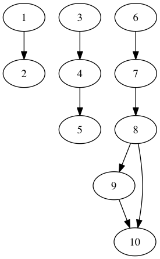

## Install

Requires Python3

Install [Postgres.app](http://postgresapp.com/)

```
$ brew install kafka graphviz
$ pip install -r requirements.txt

$ createdb schedule
$ psql -d schedule -f tables.sql
```

## Usage

Start Postgres.app

```
$ zkServer start
$ kafka-server-start server.properties

$ ipython -i js/main.py
```

Generate fake data

```python
# Generate new changes for the root datasets
root_datasets = db.load_root_datasets(cur)
changes = gen_changes(root_datasets)

# Push those changes into Kafka
stream.push_changes(producer, changes)
```

Run all jobs until a new steady state is reached

```python
# Pull changes from Kafka and store them in the DB
pull_new_changes(cur, consumer)

# Run new changes
process_pending_changes(cur)
```

## Example



Changes

```
[
  Change(id=None, ds_id=1, status='pending', start=datetime.datetime(2016, 1, 4, 0, 0), stop=datetime.datetime(2016, 1, 10, 0, 0), created_at=datetime.datetime(2016, 7, 10, 12, 7, 28)),
  Change(id=None, ds_id=2, status='pending', start=datetime.datetime(2016, 1, 1, 0, 0), stop=datetime.datetime(2016, 1, 8, 0, 0), created_at=datetime.datetime(2016, 7, 10, 12, 7, 28)),
  Change(id=None, ds_id=4, status='pending', start=datetime.datetime(2016, 1, 6, 0, 0), stop=datetime.datetime(2016, 1, 16, 0, 0), created_at=datetime.datetime(2016, 7, 10, 12, 7, 28)),
  Change(id=None, ds_id=9, status='pending', start=datetime.datetime(2016, 1, 1, 0, 0), stop=datetime.datetime(2016, 1, 7, 0, 0), created_at=datetime.datetime(2016, 7, 10, 12, 7, 28))
]
```

Execution Log

```
started		 change(1, 1, running, 2016-01-04 00:00:00 - 2016-01-10 00:00:00)
started		 change(2, 2, running, 2016-01-01 00:00:00 - 2016-01-08 00:00:00)
started		 execution(1, 3, running)
execute		 job(3, 3, jobs/coutls.sh)
finished	 execution(1, 3, successful)
started		 change(3, 4, running, 2016-01-06 00:00:00 - 2016-01-16 00:00:00)
started		 execution(2, 5, running)
execute		 job(5, 5, jobs/fkealc.sh)
finished	 execution(2, 5, successful)
started		 execution(3, 6, running)
finished	 execution(3, 6, successful)
started		 change(4, 9, running, 2016-01-01 00:00:00 - 2016-01-07 00:00:00)
started		 execution(4, 10, running)
execute		 job(10, 10, jobs/xibbht.sh)
finished	 execution(4, 10, successful)
started		 change(5, 3, running, 2016-01-05 00:00:00 - 2016-01-08 00:00:00)
started		 execution(5, 5, running)
execute		 job(5, 5, jobs/fkealc.sh)
finished	 execution(5, 5, successful)
started		 change(6, 5, running, 2016-01-01 00:00:00 - 2016-01-05 00:00:00)
started		 execution(6, 6, running)
finished	 execution(6, 6, successful)
started		 change(7, 10, running, 2016-01-05 00:00:00 - 2016-01-07 00:00:00)
started		 change(8, 5, running, 2016-01-01 00:00:00 - 2016-01-08 00:00:00)
started		 execution(7, 6, running)
execute		 job(6, 6, jobs/vwtfgu.sh)
finished	 execution(7, 6, successful)
started		 change(9, 6, running, 2016-01-06 00:00:00 - 2016-01-08 00:00:00)
```
